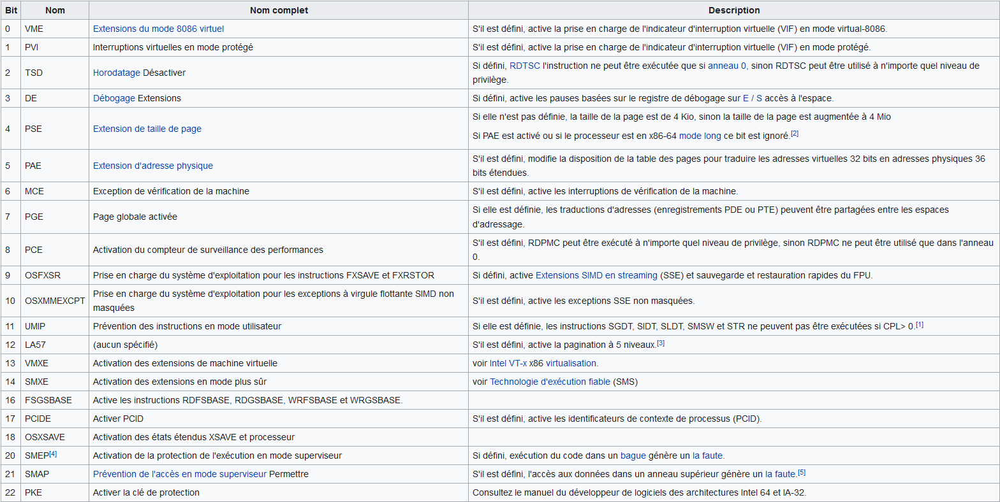

# SMEP - Supervisor Mode Execution Protection

### Theory

Supervisor Mode Execution Prevention (SMEP) can be used to prevent the supervisor mode from unintentionally executing user space code. for example kernel pointers (symbols) found in /proc/kallsyms can not be used without bypass.

#### Smep activation

By default in a linux system the cpu protection is activated via the control register the smep protection is activated via the CR4

By setting the 20th bit to 1 in the CR4 register smep is enabled. On linux a function implemented in the kernel has the role to assign the right value to the CR4 register according to the activated protection&#x20;



.png>)

#### View if smep is activated

```bash
grep "smep" /proc/cpuinfo | head -1
```

#### Disable smep

kernel boot parameter to disable smep with flag `nosmep`

### Refererences

**EN**

* [**https://defaultsec.eu/articles/kernel-exploit/world-of-kernel-in-pwn**](https://defaultsec.eu/articles/Articles%20b670077918604977ab9c1314f698cab5/Linux%20Kernel%20Exploitation%20fbaef51c6910418a92220e950a2bfac5/World%20of%20kernel%20in%20pwn%20b629d9d2e8ea4b34aa77bc370b5563f1.html)
* ****[**https://lkmidas.github.io/posts/20210128-linux-kernel-pwn-part-2/#adding-smep**](https://lkmidas.github.io/posts/20210128-linux-kernel-pwn-part-2/#adding-smep)****
* ****[**https://en.wikipedia.org/wiki/Supervisor\_Mode\_Access\_Prevention**](https://en.wikipedia.org/wiki/Supervisor\_Mode\_Access\_Prevention)****
